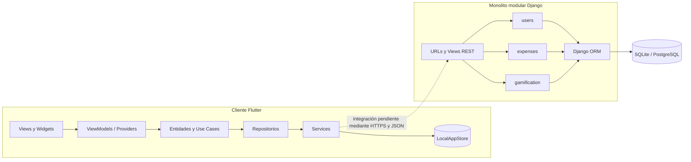

# Arquitectura de Monify

## Visión general

Monify se organiza como dos aplicaciones dentro de un mismo repositorio:

- Un cliente móvil Flutter con arquitectura por capas, MVVM, Repository y Use Cases.
- Una API Django REST construida como monolito modular.

No es una arquitectura de microservicios: el backend se despliega como una sola aplicación, comparte configuración y base de datos, y separa responsabilidades mediante módulos Django.

## Cliente móvil

La separación `presentation → domain → data` reduce el acoplamiento con Flutter y con la fuente de datos. MVVM concentra el estado de pantalla en clases basadas en `ChangeNotifier`; los casos de uso representan acciones del negocio; Repository abstrae la procedencia de los datos; y los services encapsulan la infraestructura.

En el estado actual, `LocalAppStore` es la fuente efectiva. Mantiene cuentas, sesión y transacciones únicamente en memoria y devuelve datos simulados de categorías, estadísticas y gamificación. Por ello, ejecutar el cliente no requiere que Django esté activo, pero tampoco ofrece persistencia real.

Consulta [MOBILE-PATTERNS.md](MOBILE-PATTERNS.md) para las responsabilidades y limitaciones detalladas.

## Backend

Django funciona como un **monolito modular**:

- `users` gestiona registro, acceso, perfil y datos financieros básicos.
- `expenses` gestiona categorías, transacciones y agregados.
- `gamification` gestiona logros, asignaciones y rachas.
- `Backend` concentra configuración, middleware y rutas raíz.

Cada módulo mantiene modelos, serializers, views, URLs, administración, migraciones y pruebas dentro del mismo proceso. Este diseño resulta adecuado para el tamaño actual porque conserva límites funcionales sin introducir despliegues distribuidos, comunicación entre servicios ni consistencia eventual.

La autenticación aún requiere alineación: el modelo `users.User` no está configurado como `AUTH_USER_MODEL`, mientras Simple JWT y las vistas protegidas trabajan con el usuario autenticado de Django. Esto debe resolverse antes de considerar estable la integración con el cliente.

La estructura de entidades se detalla en [BACKEND-STRUC.md](BACKEND-STRUC.md).

## Flujo actual y flujo objetivo

### Actual

1. La vista Flutter crea o escucha un ViewModel/provider.
2. El estado invoca un caso de uso o repositorio.
3. El repositorio delega en un service.
4. El service usa `LocalAppStore`.
5. Django permanece como aplicación independiente.

### Objetivo de integración

1. El cliente autentica al usuario contra Django y recibe tokens.
2. Un service HTTP envía solicitudes JSON con el token de acceso.
3. Django valida permisos, ejecuta reglas y persiste mediante su ORM.
4. El repositorio móvil traduce respuestas a entidades del dominio.
5. El ViewModel publica estados de carga, datos y errores a la interfaz.

## Decisiones y límites

| Decisión | Justificación |
| --- | --- |
| Monolito modular para Django | Menor complejidad operativa y límites de dominio suficientes para la etapa actual. |
| Capas y MVVM en Flutter | Separa UI, estado, reglas y fuentes de datos; facilita pruebas y sustitución de infraestructura. |
| Repository | Evita que presentación y dominio dependan de almacenamiento local o HTTP. |
| REST/JSON como frontera prevista | Django REST Framework ya expone endpoints consumibles por un cliente móvil. |
| SQLite local y PostgreSQL en producción | Configuración sencilla para desarrollo y base relacional apropiada para despliegue. |

No se considera necesario migrar a microservicios mientras los módulos puedan evolucionar dentro del mismo despliegue. Clean Architecture se usa como guía de dependencias, no como cumplimiento estricto: aún existen duplicidades y lógica estática en presentación.

## Evolución técnica recomendada

1. Consolidar contratos de repositorio y un único punto de inyección de dependencias en Flutter.
2. Implementar services HTTP, gestión segura de tokens y mapeo consistente de errores.
3. Aplicar autenticación y aislamiento por usuario en todos los endpoints sensibles.
4. Añadir pruebas unitarias del dominio y backend, pruebas de widgets y flujos de integración.
5. Incorporar observabilidad y pruebas de carga controladas antes de aumentar tráfico o separar servicios.
