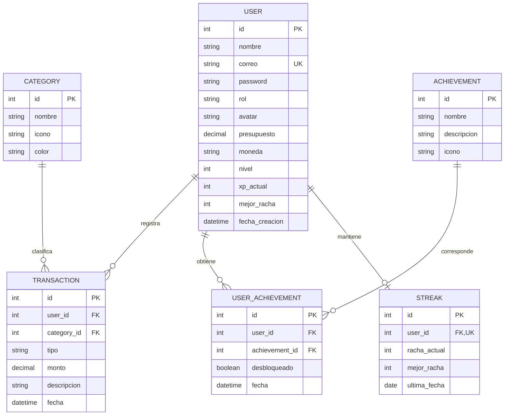
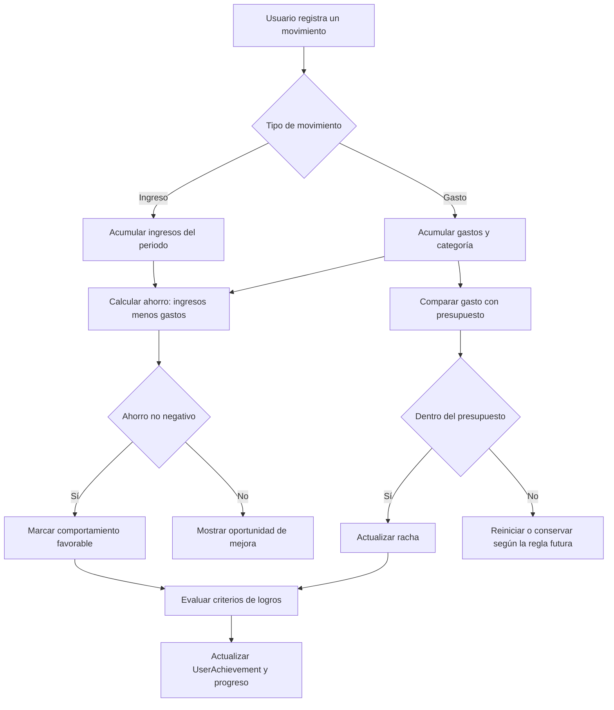
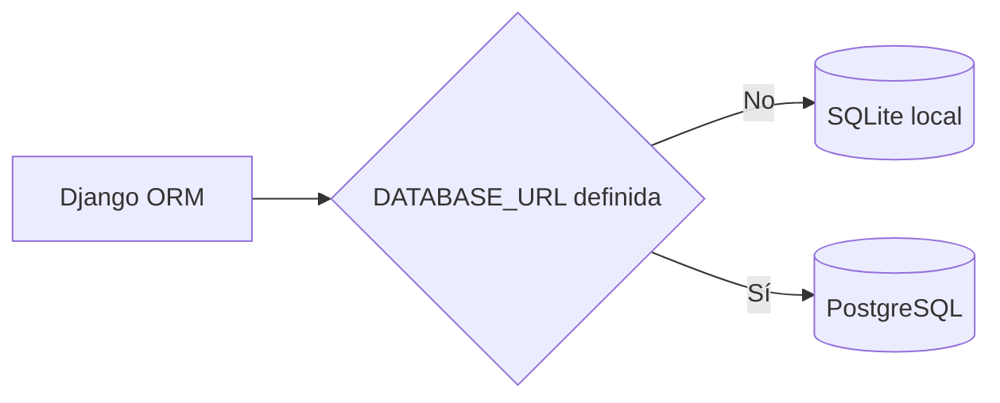

# Estructura de datos y procesos del backend

## Modelo vigente

El backend es una API Django REST dividida en tres módulos de dominio: `users`, `expenses` y `gamification`. El siguiente diagrama representa exclusivamente los modelos que existen actualmente.



## Entidades

- **User:** contiene identidad, rol, presupuesto, moneda y progreso general. El correo es único.
- **Category:** catálogo visual usado para clasificar movimientos.
- **Transaction:** ingreso o gasto asociado obligatoriamente a un usuario y una categoría.
- **Achievement:** definición reutilizable de un logro.
- **UserAchievement:** relación entre usuarios y logros, junto con su estado y fecha de desbloqueo.
- **Streak:** racha financiera de un usuario. La relación uno a uno garantiza como máximo una racha por usuario.

Las relaciones hacia `User`, `Category` y `Achievement` usan borrado en cascada. Eliminar una entidad principal elimina también sus registros relacionados.

## Ahorro y hábitos financieros

El ahorro no es una tabla. Es una métrica derivada para un periodo:

```text
ahorro = suma de ingresos - suma de gastos
```

El endpoint de resumen diario ya aplica esa fórmula. El presupuesto se almacena en `User`, mientras que las rachas y los logros permiten representar constancia y buenas prácticas.



> [!NOTE]
> El cálculo del resumen diario sí está implementado. La evaluación automática del presupuesto, la política completa de rachas y el desbloqueo automático de logros todavía no forman un flujo transaccional único en el backend; el diagrama muestra la evolución funcional prevista.

## Persistencia por entorno



- **Desarrollo local:** Django crea `db.sqlite3`, archivo excluido de Git.
- **Producción:** `dj-database-url` configura PostgreSQL mediante `DATABASE_URL`.
- **Archivos estáticos:** WhiteNoise sirve el contenido recolectado en `staticfiles`.

## Evolución prevista

- Conectar los services de Flutter con los endpoints REST y reemplazar el estado temporal.
- Integrar `users.User` formalmente con el sistema de autenticación de Django o sustituirlo por un modelo compatible. Actualmente no está declarado como `AUTH_USER_MODEL`, aunque las vistas protegidas y Simple JWT dependen de `request.user`.
- Asegurar que las consultas y mutaciones de transacciones siempre estén limitadas al usuario autenticado.
- Definir reglas atómicas para presupuesto, rachas, experiencia y desbloqueo de logros.
- Evaluar una entidad de meta de ahorro solamente cuando existan requisitos de importe, plazo y progreso histórico; no forma parte del esquema vigente.
- Añadir restricciones de unicidad para evitar logros duplicados por usuario y pruebas de permisos entre usuarios.
