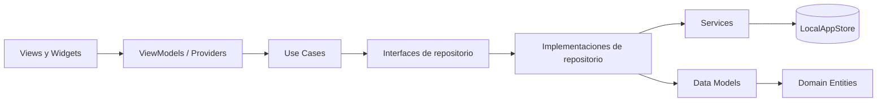

# Patrones de diseño de la aplicación móvil

## Enfoque actual

`monify_app_mobile` aplica una arquitectura híbrida inspirada en **Clean Architecture**, combinada con **MVVM**, **Repository** y **Use Cases**. La intención es separar interfaz, estado, reglas de negocio y acceso a datos sin imponer la complejidad de una Clean Architecture estricta a un prototipo todavía pequeño.

## Responsabilidad de cada capa

| Capa | Ubicación actual | Responsabilidad |
| --- | --- | --- |
| Presentación | `lib/screens`, `lib/presentation` | Renderizar la interfaz, gestionar eventos y exponer estados de carga, éxito y error. |
| Dominio | `lib/domain` | Representar entidades, contratos de repositorio y casos de uso independientes de la UI. |
| Datos | `lib/data` | Convertir modelos, implementar repositorios y encapsular la fuente de datos. |
| Infraestructura local | `lib/data/services/local_app_store.dart` | Simular autenticación, transacciones, categorías, estadísticas y gamificación en memoria. |
| Navegación | `lib/navigation` | Centralizar nombres de rutas y su construcción mediante `AppRouter`. |
| Apariencia | `lib/themes` | Definir temas claro y oscuro reutilizables. |

### MVVM con `ChangeNotifier`

Los ViewModels y providers heredan de `ChangeNotifier`, mantienen el estado de pantalla y notifican cambios con `notifyListeners()`. Las vistas deberían limitarse a composición visual, navegación y eventos de interfaz; la validación reutilizable y las operaciones del dominio pertenecen a casos de uso o ViewModels.

### Repository y Services

Los repositorios actúan como frontera entre dominio y datos. Reciben modelos desde los servicios, los convierten a entidades y evitan que la UI conozca la fuente concreta. Actualmente los servicios delegan en `LocalAppStore`; al integrar Django, esa implementación podrá sustituirse por un cliente HTTP sin cambiar los contratos del dominio.

### Use Cases

Los casos de uso encapsulan operaciones como iniciar sesión, registrar una cuenta, crear o filtrar transacciones y actualizar una racha. Son útiles cuando una regla debe reutilizarse o no pertenece a una pantalla concreta.

## ¿Por qué se eligió este enfoque?

- Permite desarrollar la experiencia móvil mientras la API evoluciona por separado.
- Hace reemplazable el almacenamiento temporal por una fuente remota.
- Facilita probar reglas y estado sin renderizar toda la aplicación.
- Mantiene el proyecto comprensible para un equipo pequeño y admite crecimiento por funcionalidades.

## Límites del prototipo

El patrón está parcialmente aplicado y no debe interpretarse como una implementación terminada:

- Algunas pantallas todavía contienen datos estáticos o lógica de presentación extensa.
- Existen providers y ViewModels con responsabilidades parcialmente duplicadas.
- Hay interfaces de repositorio en `domain` y abstracciones adicionales dentro de `data`; conviene unificarlas al conectar la API.
- Las dependencias se crean directamente en varias pantallas en lugar de usar un punto único de inyección.
- `LocalAppStore` no persiste información ni ofrece sincronización, caché o funcionamiento offline real.
- La aplicación bloquea la orientación vertical, lo que limita la adaptación a tablets, pantallas divididas y dispositivos plegables.
- La nomenclatura y ubicación de algunas pantallas aún no siguen de manera uniforme las convenciones de Dart ni una organización completa por funcionalidades.

## Dirección recomendada

La evolución natural es conservar los contratos del dominio, implementar servicios HTTP para Django, centralizar la inyección de dependencias y reorganizar presentación por funcionalidad. Esa migración debe hacerse gradualmente y acompañada por pruebas unitarias, de widgets e integración.

